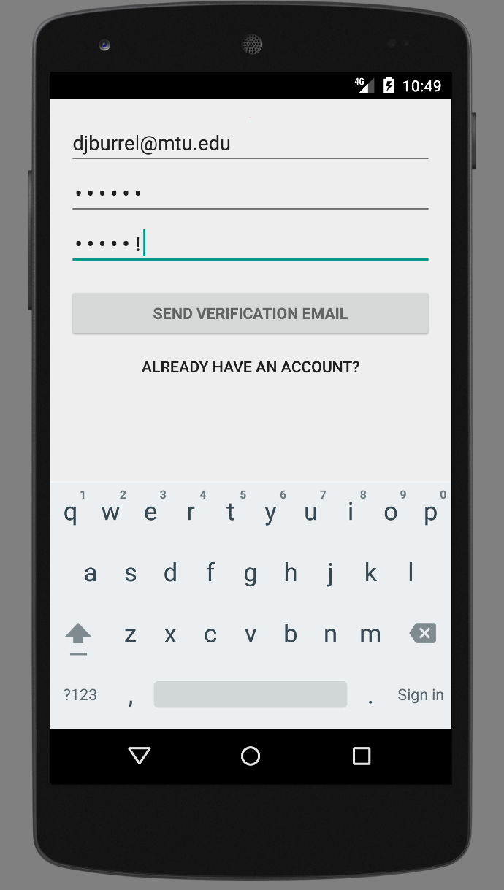

## User Guide

BlizzardBoard is a mobile app that allows you to post bulletins and view posts made by others within the Michigan Tech community.

The app must be run on an Android device or emulator.

### Registration

Once the app is launched, you will be prompted to create a new account.

If you already an account, you may select the appropriate link and log in using your existing credentials.

Registration requires a valid email dress on the `mtu.edu` domain.



```markdown
Syntax highlighted code block

# Header 1
## Header 2
### Header 3

- Bulleted
- List

1. Numbered
2. List

**Bold** and _Italic_ and `Code` text

[Link](url) and 
```

For more details see [GitHub Flavored Markdown](https://guides.github.com/features/mastering-markdown/).

### Jekyll Themes

Your Pages site will use the layout and styles from the Jekyll theme you have selected in your [repository settings](https://github.com/derekburrell/BlizzardBoard/settings). The name of this theme is saved in the Jekyll `_config.yml` configuration file.

### Support or Contact

Having trouble with Pages? Check out our [documentation](https://help.github.com/categories/github-pages-basics/) or [contact support](https://github.com/contact) and we’ll help you sort it out.
