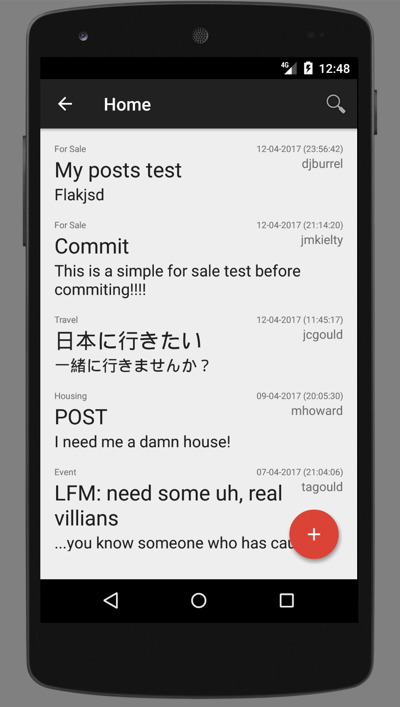

## User Guide

BlizzardBoard is a mobile app that allows you to post bulletins and view posts made by others within the Michigan Tech community.

The app must be run on an Android device or emulator.

### Registration

Once the app is launched, you will be prompted to create a new account. If you already have an account, you may select the appropriate link and log in using your existing credentials.

Registration requires an active email address on the `mtu.edu` domain.

A valid password contains a minimum of six characters, including at least one lower-case letter, one upper-case letter, one number, and one special character (any non-letter/non-number).

With the **MTU Email**, **Password**, and **Confirm Password** fields filled out, select **SEND VERIFICATION EMAIL** to receive a link for account activation by email. You will be redirected to the login page upon completion.

Click the link to confirm your email address and activate your new account.

### Login

From the login page, enter your **MTU Email** and **Password** and select **SIGN IN** to begin using the app.

If you do not know your password, you may enter only your **MTU Email** and select **FORGOT PASSWORD?** to receive an email with a password reset link.

Click the link to choose a new password for your user account.

### Home

The app lands on the Home page once the user is logged in. Here, posts made by all app users can be viewed in reverse-chronological order.

Each post has a title, a description, and a category.

Click the ⊕ button to create a new post. Give the post a title, select a category (For Sale, Housing, Travel, or Event), type out a description for your post and hit **SUBMIT** when finished to display it on the bulletin board.

Once the post is pulbished, it can be seen at the top of the Home feed.

### Navigation

Select the ← button to navigate the app by selecting between Home, Categories, My Posts, Husky Chat, Preferences, and Logout panes.

### Categories

This section allows the user to filter posts by category so that only bulletins of a specific type are displayed.

### My Posts

This section allows the user to view only posts made by him/herself personally.

### Husky Chat

This page is a public chat room for open communication between all app users. Select the **Input** field and type out a message to be sent.

Click the ✉ icon to send. Your message now appears at the bottom of a chronologically-ordered discussion feed.

### Preferences

This feature will be implemented at a later date.

### Logout

Selecting this option from the navigation pane signs the user out and returns to the Login screen.
